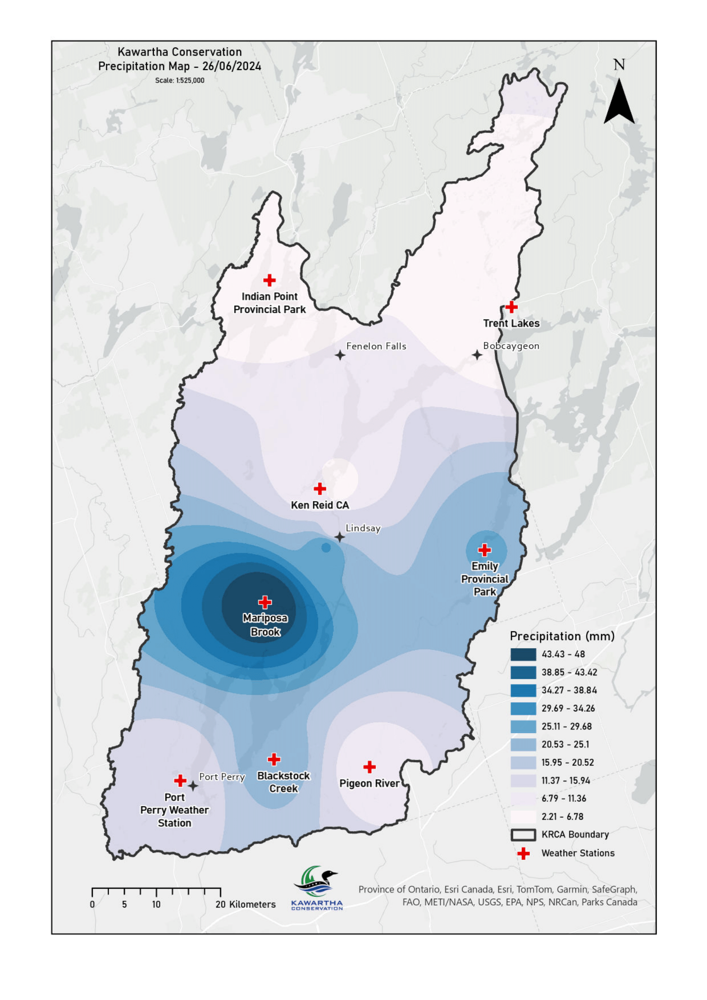

# Precipitation

This repository contains scripts for mapping and interpolating precipitation data.

## Contents

- `LICENSE`: The license for this project.
- `README.md`: This file, containing information about this project.
- `Map.png`: An image file related to the project.
- `ws.py`: A Python script file.
- `ws.png` : The icon file.

## Setup

To run the scripts in this repository, you'll need to have certain Python libraries installed. You can install them using pip:

```bash
pip install -r requirements.txt
```

## Usage

You can run the main script `ws.py` as follows:

```bash
python ws.py
```


Map created in ArcGIS Pro with the shapefile and data generated using the ws tool,
IDW Interpolation with a power of 3 and default cell size used to derive the map.

## Contributing

Contributions to this project are welcome. Please feel free to fork this repository, make your changes, and submit a pull request.

## License

This project is licensed under the terms of the LICENSE file in this repository.


